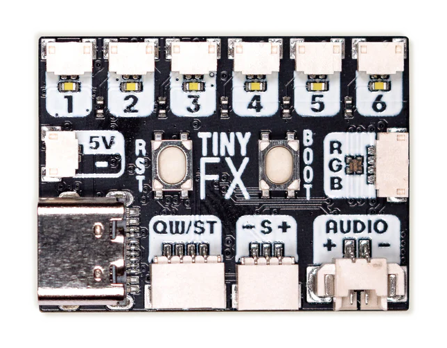

***********************************************************
tinyfx-i2c-target: The Pimoroni TinyFX as an I2C Peripheral
***********************************************************

**Note**

While this library is suitable for controlling a TinyFX there is also a generic
controller available that you can use for your own purposes. This should work
with *any* RP2040/RP2350 microcontroller board.

   The Pimoroni TinyFX.

Description
***********

The Pimoroni TinyFX is a postage stamp sized board that controls up to six
channels of LEDs, an RGB LED, plays audio from a speaker, and even has an
attachment for a PIR sensor to detect warm moving bodies.

Pimoroni describe it as:

    Tiny FX is an effects controller for the LED dots and strips that can
    be found in third-party LEGO®-compatible lighting kits. These LEDs are
    connected up by thin, flexible wires that can easily be concealed
    around/behind/within your model. Typically they're powered direct from
    an alkaline battery pack or USB, so the LEDs are lit all the time - and
    we wanted our illuminated creations to have more smarts!
    — `Pimoroni TinyFX <https://shop.pimoroni.com/products/tinyfx>`_

Installing this library on a Pimoroni TinyFX permits it to be used as an I2C
target|slave, i.e., it can be controlled remotely from an I2C controller|master
such as a Raspberry Pi or a microcontroller such as an RP2040, ESP32, STM32, etc.

Installation
************

The target|slave code resides on the TinyFX, so copy the entire contents of the
tinyfx directory to your TinyFX. The main.py file determines which controller
will be called when receiving data over I2C::

   * **TinyFxController**: this handles messages specific to controlling a TinyFX.
   * **Controller**:       this is a generic controller that can either be modified
                          or subclassed for your own application.

The controller|master code resides on either a Raspberry Pi (tinyfx_ctrl.py) or
a microcontroller (tinyfx_ctrl_mpy.py).

If using a microcontroller you'll need to copy the tinyfx_ctrl_mpy.py,
message_util.py and crc8_table.py files to it. You'll also need to modify the
values for the SDA and SCL pins in tinyfx_ctrl_mpy.py to match the board you're
using. You may also need to modify the I2C bus number. Consult the documentation
for your board, there are no defaults that work for all.

Usage
*****

From CPython (e.g., a Raspberry Pi), execute the tinyfx_ctrl.py file to display
its command line, from where you can type commands::

    ch[1-6] on|off        # control channels
    all on|off            # turn all channels on or off (including RGB LED)
    heartbeat on|off      # blinking RGB LED
    color [name]          # set RGB LED to color name (see colors.py)
    play [sound-name]     # play a sound (a *.wav file in sounds directory)

From a MicroPython REPL, first type::

   >>> from tinyfx_ctrl_mpy import send

   TinyFX I2C Master Control

   ready for:  send('command')

   >>> send('play beep')

Examples include::

    ch2 on
    ch3 off
    all off
    heartbeat on
    color violet
    play beep

Setting the heartbeat or color will disable the other.

The distribution includes two sound files, beep and arming-tone. The latter
is automatically played with the TinyFX starts up (if it has a connected
speaker, of course). If you don't want this to occur, comment out the line
in the constructor.

You can add your own WAV files to the sounds directory. The WAV files must
be compatible with the TinyFX. Note that the "*.wav" extension is automatically
added to the sound name.

The PIR sensor functionality currently is not working/has not been tested.

Requirements
************

This requires Python 3 on the master, and a Pimoroni MicroPython build supporting
I2CTarget such as "tiny_fx-2a5a3aaeb5cd7114ec6657611e2edaed25fc5664-micropython"
as found at: https://github.com/pimoroni/picofx/actions/runs/19371986148

Installation on the TinyFX is relatively simple: hold down the BOOT button, then
press RST and release, then release BOOT. This will cause the TinyFX to be mounted
to your computer. You can then copy or drag-and-drop the distribution file directly
onto the mounted drive. It will then reset and update the firmware. You will then
be able to confirm the installation from the Python REPL::

    /pyboard> repl
    Entering REPL. Use Control-X to exit.
    >
    MicroPython v1.26.1 on 2025-11-14; Pimoroni TinyFX with RP2040
    Type "help()" for more information.

You should see the "MicroPython v1.26.1 on 2025-11-14; Pimoroni TinyFX with RP2040"
identifier, or a suitable update from Pimoroni.

Status
******

* 2025-11-17: first public release

Support & Liability
*******************

Please note that this project is an independent work and not associated with
Pimoroni Ltd.

This project comes with no promise of support or acceptance of liability. Use at
your own risk.

Copyright & License
*******************

All contents (including software, documentation and images) Copyright 2020-2025
by Ichiro Furusato. All rights reserved.

Software and documentation are distributed under the MIT License, see LICENSE
file included with project.

